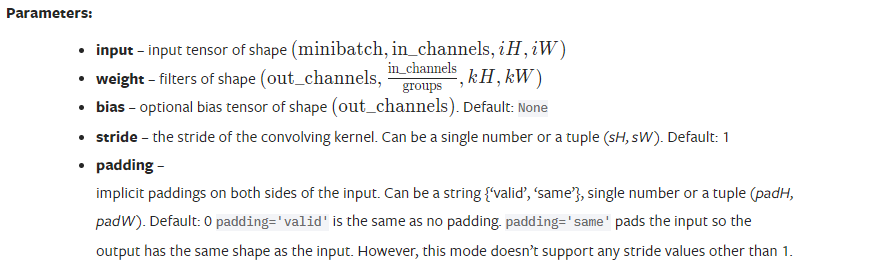

# pytorch学习笔记

### 1. 杂项

#### 1. TransForms.py

在计算机视觉任务中，`transforms`模块是PyTorch中的一个重要模块，用于数据预处理和增强。其中的`transforms.ToTensor()`将PIL图像或NumPy数组转换为PyTorch张量。

在PyTorch中，张量（`tensor`）是一种多维数组结构，类似于NumPy中的数组，但具有额外的特性。张量可以在GPU上进行加速计算，并且可以与其他PyTorch模块和函数无缝集成。

通过`transforms.ToTensor()`转换后，图像或数组将被转换为浮点型张量，并且像素值将被归一化到\[0, 1]的范围内。例如，如果原始图像的像素值范围是\[0, 255]，执行`transforms.ToTensor()`后，像素值将被除以255，使其范围变为\[0, 1]。转换后的张量形状将与原始图像或数组的形状相同，但数据类型为`torch.float32`。

这样的转换对于深度学习常见的图像输入非常有用，因为深度学习模型通常要求输入为张量形式，并且在训练过程中进行归一化等预处理操作。

以下是一个示例，演示如何使用`transforms.ToTensor()`将图像转换为张量：

```python
import torchvision.transforms as transforms
from PIL import Image

# 加载图像
image = Image.open('image.jpg')

# 定义转换
transform = transforms.ToTensor()

# 执行转换
tensor_image = transform(image)
```

执行上述代码后，`tensor_image`将包含原始图像的张量表示形式，可以使用这个张量作为模型的输入。

#### 2. ToTensor()函数

* ToTensor()函数用于将PIL图像或NumPy数组转换为Tensor形式，并按照一定规则进行值的缩放。
* 转换的结果是一个FloatTensor，形状为(C x H x W)，值范围在\[0.0, 1.0]之间。
* 当输入是PIL图像且属于(L, LA, P, I, F, RGB, YCbCr, RGBA, CMYK, 1)中的一种模式，或者输入是dtype为np.uint8的NumPy数组时，进行像素值缩放，否则返回未缩放的Tensor。

注意事项：

* 由于输入图像被缩放到\[0.0, 1.0]的范围内，这个转换操作不适用于图像遮罩等目标图像的转换。
* 在处理目标图像遮罩时，需要参考相关文档中提供的实现方法。

注：L, LA, P, I, F, RGB, YCbCr, RGBA, CMYK, 1是表示图像模式的常见标识符。它们代表了不同的图像颜色空间和通道数的组合。

这些标识符的含义如下：

* L：表示灰度图像（单通道图像），每个像素用8位表示，取值范围为0-255。
* LA：表示带有透明度的灰度图像（两通道图像），第一个通道是灰度值，第二个通道是透明度值。
* P：表示调色板图像（颜色映射索引图像），像素值存储的是颜色表中的索引值，通过调色板（调色板是一个颜色映射表）来获取真实的颜色。
* I：表示32位整型图像（单通道图像），每个像素用32位有符号整数表示。
* F：表示32位浮点数图像（单通道图像），每个像素用32位浮点数表示。
* RGB：表示RGB彩色图像（三通道图像），每个通道用8位表示，分别表示红色、绿色和蓝色的强度值。
* YCbCr：表示YCbCr彩色图像（三通道图像），每个通道用8位表示，分别表示亮度、蓝色差和红色差的强度值。
* RGBA：表示带有透明度的RGB彩色图像（四通道图像），第一个通道是红色，第二个通道是绿色，第三个通道是蓝色，第四个通道是透明度。
* CMYK：表示CMYK彩色图像（四通道图像），每个通道用8位表示，分别表示青色、洋红色、黄色和黑色的强度值。
* 1：表示二值图像（单通道图像），每个像素只能取0或1。

这些标识符描述了图像的颜色模式和通道数，ToTensor()函数会根据这些标识符来判断是否进行像素值缩放操作。

#### 3. Normalize()函数

函数的作用是根据给定的均值(mean)和标准差(std)对每个通道的输入张量图像进行标准化处理，使得输出的每个通道的数值符合标准正态分布。

函数的关键点总结如下：

* 函数不支持PIL图像，仅适用于torch.\*Tensor（PyTorch张量）。
* 函数输入两个参数，mean和std，分别表示每个通道的均值和标准差。
* 函数会对输入的每个通道进行独立的标准化处理，使用公式：output\[channel] = (input\[channel] - mean\[channel]) / std\[channel]。
* 函数的操作是在原有输入张量的副本上进行的，即不会改变原有输入张量的值。
* 可选参数inplace可以用于指定是否进行原地操作（即覆盖原有张量），默认为False。

此函数适用于对图像数据进行预处理，常用于神经网络训练过程中对输入数据的标准化处理，以提高训练效果和稳定性。

注：在文档中，`torch.*Tensor` 中的星号（\*）表示通配符，用于表示一类张量类型，它可以匹配任何以 torch 开头的张量类型，比如 torch.FloatTensor、torch.DoubleTensor 等。

而 i.e. 是拉丁文 "id est" 的缩写，意思是 "即" 或 "也就是说"。在这个上下文中，i.e. 用来对前面所述内容进行进一步解释，即在这里表示 `torch.*Tensor` 即代表了所有以 torch 开头的张量类型。

相关资料：

* \[为什么深度学习中一般使用mean=[0.485, 0.456, 0.406\]和std=\[0.229, 0.224, 0.225\]来归一化图像?](https://blog.csdn.net/zylooooooooong/article/details/122805833)
* [浅谈对transforms.ToTensor()和transforms.Normalize()函数的理解](https://blog.csdn.net/m0\_59249046/article/details/126800077)

#### 4. Resize()函数

对输入的图像进行尺寸调整。如果输入是torch Tensor类型，它应具有形状`[..., H, W]`，其中`...`表示任意数量的前导维度。

由于PIL应用了抗锯齿技术，在缩小采样时，PIL图像和张量的插值会略有不同。这可能导致网络性能上的显著差异。因此，最好使用相同类型的输入来训练和服务模型。可以通过下面的“antialias”参数来调整PIL图像和张量的输出，以使它们更接近。

函数的参数如下：

* size: 所期望的输出尺寸。如果size是一个类似(h, w)的序列，输出尺寸将匹配该序列。如果size是一个整数，图像的较小边将匹配该数字。例如，如果高度大于宽度，则图像将被调整为(size \* height / width, size)；如果是宽度大于高度，则图像将被调整为(size \* width / height , size)。

注：在PIL的Image中，size元组的第一个参数是宽，第二个参数是高。

* interpolation: 所期望的插值方式，可以是InterpolationMode中的枚举值。默认是InterpolationMode.BILINEAR。如果输入是Tensor类型，只支持InterpolationMode.NEAREST、InterpolationMode.NEAREST\_EXACT、InterpolationMode.BILINEAR和InterpolationMode.BICUBIC。也接受对应的Pillow整数常量，如PIL.Image.BILINEAR。
* max\_size: 调整尺寸后的图像的长边最大允许值。如果按照size参数调整尺寸后，图像的长边大于max\_size，则再次调整图像，使长边等于max\_size。因此，size参数可能会被覆盖，即较小边可能会比size更短。仅当szie是一个整数时（或者在torchscript模式中的长度为1的序列），才支持该参数。
* antialias: 是否应用抗锯齿技术。它只影响双线性或双三次插值模式的张量。对于PIL图像，始终在双线性或双三次插值模式下应用抗锯齿技术；对于其他模式（适用于PIL图像和张量），抗锯齿技术无效，此参数将被忽略。可能的取值有：
  * True: 对双线性或双三次插值模式的张量应用抗锯齿技术。其他模式不受影响。这可能是您想要使用的设置。
  * False: 不对张量的任何模式应用抗锯齿技术。PIL图像仍在双线性或双三次插值模式下应用抗锯齿技术，因为PIL不支持关闭抗锯齿。
  * None: 对张量等同于False，对PIL图像等同于True。这个值存在是为了与以前的版本兼容，并且除非你确切知道自己在做什么，否则不建议使用。

总之，该函数用于调整输入图像的大小，并提供了一些参数选项来控制插值方式、最大尺寸和是否应用抗锯齿技术。

#### 5. Compose()函数

它可以将多个变换组合在一起。它接受一个由 `Transform` 对象组成的列表作为参数，并按顺序应用这些变换。

例如，下面的代码将创建一个组合变换，它首先对图像进行中心裁剪，然后将其转换为张量，最后将其转换为浮点类型：

```python
transforms.Compose([
    transforms.CenterCrop(10),
    transforms.PILToTensor(),
    transforms.ConvertImageDtype(torch.float),
])
```

官方文档还提到了在脚本化（script）转换操作时需要注意的事项。为了使转换操作可脚本化，建议使用`torch.nn.Sequential`类来替代`Compose`类。示例展示了如何使用`Sequential`类创建一个转换操作序列，并通过`torch.jit.script`函数进行脚本化。

最后，官方文档指出要确保仅使用可脚本化的转换操作，即适用于`torch.Tensor`类型，不依赖于`lambda`函数或`PIL.Image`类型的转换操作。

注：文档中提到的"确保仅使用可脚本化的转换操作"意味着在创建转换操作序列时，应该只使用能够被脚本化的操作。

脚本化是将操作转换为静态计算图（static computational graph）的过程，以便在运行时进行优化和加速。为了使操作可以被脚本化，需要满足一些要求。其中两个重要的要求是：

1. 适用于`torch.Tensor`类型：脚本化的操作需要能够处理`torch.Tensor`类型的数据。这是因为在脚本化过程中，操作的计算图会被转换为特定的张量操作代码。
2. 不依赖于`lambda`函数或`PIL.Image`类型：脚本化过程无法转换`lambda`函数或依赖于`PIL.Image`类型的操作。`lambda`函数是匿名函数，由于无法在静态图中表示，所以不能被脚本化。同样地，某些操作可能涉及对图像进行处理，而脚本化过程只能处理张量操作。

#### 6. 张量

为了处理多维的数据，而出现的一个概念，例如零维的**标量**、一维的**数组**、二维的**矩阵**、三维的**空间矩阵**、还有四维，五维，乃至六维。Pytorch为了把这些各种维统一起来，所以起名叫**张量。**

而且，张量在PyTorch中有多种类型，常见的类型包括：

1. torch.FloatTensor：即浮点型张量，用于存储浮点数数据。
2. torch.DoubleTensor：双精度浮点型张量，用于存储双精度浮点数数据。
3. torch.HalfTensor：半精度浮点型张量，用于存储半精度浮点数数据。
4. torch.ByteTensor：字节型张量，用于存储布尔值或二值数据。
5. torch.CharTensor：字符型张量（8位整数），用于存储字符数据。
6. torch.ShortTensor：短整型张量（16位整数），用于存储整数数据。
7. torch.IntTensor：整型张量（32位整数），用于存储整数数据。
8. torch.LongTensor：长整型张量（64位整数），用于存储整数数据。

参考资料：

[什么是张量？ - 知乎 (zhihu.com)](https://zhuanlan.zhihu.com/p/140260245)

#### 7. dtype=torch.float32

`dtype=torch.float32` 是将张量的数据类型设置为 `float32`，即单精度浮点型。

在深度学习中，数据类型的选择对模型的训练和计算性能都有影响。`float32` 是常用的浮点数数据类型之一，通常用于存储和计算实数数据。

在给定的例子中，明确指定了输入张量 `input` 和滤波器张量 `kernel` 的数据类型为 `float32`。这意味着这些张量中的每个元素都被解释为单精度浮点数。通过指定数据类型，可以确保在执行卷积操作时使用正确的数据格式，并避免类型不匹配引起的错误。

#### 8. 如何设定卷积核的个数？

<figure><figcaption></figcaption></figure>

上面是conv2d的各项参数，其中，weight指明了卷积核的各项参数，更进一步地说，其中的out\_channels便决定了卷积核的个数。

而卷积层中滤波器或卷积核的数量决定了该层能从输入图像中提取的特征图的数量。每个滤波器都被设计用来检测输入图像中的特定模式或特征，例如边缘、角落或某种形状的物体。通过使用多个滤波器，卷积层可以从输入图像中提取多个不同的特征。

下面是示例，示例中，卷积层使用了 8 个滤波器。这意味着该层可以从输入图像中提H取 8 个不同的特征图。提取的具体特征取决于滤波器的值，这些值通常在神经网络训练期间学习。

```python
>>> # With square kernels and equal stride
>>> filters = torch.randn(8, 4, 3, 3) 
>>> inputs = torch.randn(1, 4, 5, 5)
>>> F.conv2d(inputs, filters, padding=1)
```

另外，输出的图像的宽高用下面的公式计算：

<figure><figcaption></figcaption></figure>

在CNN（卷积神经网络）的语境中，"kernel"、"filter"和"feature detector"三个术语可以互换使用，指的都是卷积操作中的滤波器。

在CNN中，卷积操作通过将一个小的滤波器（即kernel/filter/feature detector）应用于输入图像的不同位置，以提取图像中的特征。这个滤波器由一组可学习的参数组成，它可以在卷积过程中通过滑动窗口的方式在图像上移动，并在每个位置上进行局部特征提取。

因此，"kernel"、"filter"和"feature detector"都指代同一个概念，即卷积操作中用于提取图像特征的可学习参数组合。

#### 9. -1的作用

在给定维度的形状参数中，如果使用-1，则表示该维度的大小将根据其他维度和总元素的数量自动计算。换句话说，-1会自动计算该维度的大小，以确保张量的总元素数保持不变。

在这句`output = torch.reshape(output, (-1, 3, 30, 30))`代码中，`output`是一个`torch.Tensor`对象，你想要将其重新形状为`(-1, 3, 30, 30)`。通过在第一个维度的位置使用-1，可以告诉PyTorch根据其他维度的大小和总元素数量来推断第一个维度的大小。

例如，假设`output`的形状为`(100, 40, 10)`，总共有 40,000 个元素。当你使用`torch.reshape(output, (-1, 3, 30, 30))`时，PyTorch会自动计算第一个维度的大小为 `40,000 / (3 * 30 * 30) = 14`，以保持总元素数不变。

因此，使用-1作为形状参数的其中一个维度可以方便地将张量重新形状为具有确定维度和总元素数的目标形状。

#### 10. add\_images函数

文档注释：

`add_images`函数是TensorBoard中的一个功能，用于向摘要中添加批量图像数据。它允许你将图像数据附加到TensorBoard摘要中，以便进行可视化和分析。

该函数接受以下参数：

* `tag`（字符串）：数据标识符，用于在TensorBoard中标识图像数据。
* `img_tensor`（torch.Tensor、numpy.ndarray或字符串/ blobname）：图像数据，可以是张量、NumPy数组或字符串/ blob名称。
* `global_step`（整数）：用于记录的全局步骤值。
* `walltime`（浮点数）：可选参数，用于覆盖默认的墙上时间（time.time()），即事件发生的秒数。
* `dataformats`（字符串）：指定图像数据格式的规范，例如NCHW、NHWC、CHW、HWC、HW、WH等。默认为`NCHW`，即`(N, 3, H, W)`的形状。

根据函数的文档注释，`img_tensor`的默认形状应为`(N, 3, H, W)`，其中`N`是批量大小，`3`是通道数，`H`和`W`是图像的高度和宽度。如果指定了`dataformats`参数，则将接受其他形状的输入。

（这句话的意思是，如果在`add_images`函数中指定了`dataformats`参数，那么该函数将接受具有不同形状的输入数据。

默认情况下，`img_tensor`参数被假设为一个具有形状`(N, 3, H, W)`的张量，其中`N`是批量大小，`3`是通道数，`H`和`W`分别是图像的高度和宽度。

然而，有时候输入的图像数据可能不符合这种默认的形状。这就是`dataformats`参数的作用。通过指定`dataformats`参数，你可以告诉`add_images`函数如何解释输入数据的形状。

例如，如果你的图像数据具有形状`(N, H, W, 3)`，即通道数出现在最后一个维度上，你可以使用`add_images`函数并将`dataformats='NHWC'`传递给它，以告诉函数如何解释输入数据的形状。

总而言之，`dataformats`参数允许你根据输入数据的形状灵活地定义如何解释图像数据。通过使用不同的`dataformats`参数，你可以处理各种形状和排列方式的图像数据，并确保它们正确地添加到TensorBoard中进行可视化和分析。）

使用示例：

```python
from torch.utils.tensorboard import SummaryWriter
import numpy as np

img_batch = np.zeros((16, 3, 100, 100))
for i in range(16):
    img_batch[i, 0] = np.arange(0, 10000).reshape(100, 100) / 10000 / 16 * i
    img_batch[i, 1] = (1 - np.arange(0, 10000).reshape(100, 100) / 10000) / 16 * i

writer = SummaryWriter()
writer.add_images('my_image_batch', img_batch, 0)
writer.close()
```

上述示例代码创建了一个大小为`(16, 3, 100, 100)`的图像批量，并将其作为`img_batch`传递给`add_images`函数。在TensorBoard中，这个图像批量将被命名为`my_image_batch`，并与全局步骤值0一起记录。

通过使用`add_images`函数，你可以将图像数据添加到TensorBoard中，以便于可视化和分析。在TensorBoard的界面上，你可以查看这些图像，并进行缩放、标记、对比等操作。

#### 11. torch.reshape()函数

`torch.reshape` 是一个 PyTorch 函数，它可以将一个张量的形状改变为指定的形状，同时保持数据和元素数量不变。当可能时，返回的张量将是输入的视图。否则，它将是一个副本。

```
inputs = torch.tensor([1, 2, 3], dtype=torch.float32)
targets = torch.tensor([1, 2, 5], dtype=torch.float32)

inputs = torch.reshape(inputs, (1, 1, 1, 3))
targets = torch.reshape(targets, (1, 1, 1, 3))
```

在上述代码中，`inputs` 是一个一维张量，形状为 `(3,)`，其中包含三个元素，分别为 `1`、`2` 和 `3`。在使用 `torch.reshape(inputs, (1, 1, 1, 3))` 函数之后，它被重塑为了四维张量，形状为 `(1, 1, 1, 3)`。

原来的元素 `1`、`2` 和 `3` 并没有改变，它们仍然存在于新的张量中。只是它们现在被存储在一个四维张量中，而不是原来的一维张量中。

可以使用以下代码来查看新张量中的元素：

```python
print(inputs[0, 0, 0, :])
```

### 2. 池化

#### 1. 池化操作的步长

池化操作的步长默认是卷积核的大小

**stride** ([_Union_](https://docs.python.org/3/library/typing.html#typing.Union)_\[_[_int_](https://docs.python.org/3/library/functions.html#int)_,_ [_Tuple_](https://docs.python.org/3/library/typing.html#typing.Tuple)_\[_[_int_](https://docs.python.org/3/library/functions.html#int)_,_ [_int_](https://docs.python.org/3/library/functions.html#int)_]\*\*]_) – the stride of the window. Default value is `kernel_size`

#### 2. 池化与卷积的区别：

卷积的作用是提取图像特征，池化的作用是保留边缘特征，减少参数，池化分为最大池化（保留边缘特征）、平均池化（保留背景特征）。

池化函数使用某一位置的相邻输出的总体统计特征来代替网络在该位置的输出。本质是 降采样，可以大幅减少网络的参数量。

### 3. 模型操作

#### 1. 2023年vgg16的下载方式

```python
import torchvision
from torchvision.models import VGG16_Weights

# 新旧对比
vgg16_false = torchvision.models.vgg16(pretrained=False)
vgg16_true = torchvision.models.vgg16(pretrained=True)
# 利用最新参数重新下载vgg16模型
vgg16_true = torchvision.models.vgg16(weights=VGG16_Weights.IMAGENET1K_V1,
                                      progress=True)  # 这是经过 ImageNet-1K 数据集训练的 VGG-16 模型的权重。适用于分类任务。
vgg16_false = torchvision.models.vgg16(weights=VGG16_Weights.IMAGENET1K_FEATURES,
                                       progress=True)  # 这些权重不能直接用于分类任务，但可用于特征提取，因为它们是从 VGG-16 模型中去除了分类器模块的权重
```

#### 2. 优化器

`torch.optim.SGD`和`torch.optim.Adam`是PyTorch中两种不同的优化器。它们的主要区别在于更新模型参数的方式和学习率的调整策略。

1. SGD（随机梯度下降）优化器：
   * SGD使用传统的梯度下降算法来更新模型的参数。
   * 更新过程中，每次迭代时都使用一个随机的小批量样本进行计算梯度和参数更新。
   * SGD通过学习率（learning rate）控制参数更新的步长。
   * 更新公式为：新参数 = 原参数 - 学习率 × 梯度。
2. Adam优化器：
   * Adam（Adaptive Moment Estimation）是一种自适应学习率的优化算法。
   * 它在梯度下降的基础上结合了动量（momentum）和自适应学习率的特性。
   * 更新过程中，Adam根据每个参数的梯度动态调整学习率，使得不同参数可以具有不同的学习率。
   * Adam还使用动量项来加速参数更新的方向。
   * 更新公式包括梯度、学习率和动量等参数。

总结：

* SGD优化器使用简单的梯度下降算法，适用于相对简单的问题，但可能需要更仔细地调整学习率和其他超参数。
* Adam优化器结合了梯度下降、动量和自适应学习率等特性，通常在深度学习中表现良好，对于大多数情况下的模型训练都是一个不错的选择。但是，它也可能需要更多的内存和计算资源。

对于选择使用哪个优化器，需要根据实际问题和模型的性能进行评估和比较，以找到最佳的优化器设置。

#### 3. pytorch中的torch.argmax函数

```
x = torch.randn(3, 5)
print(x)
print(torch.argmax(x))
print(torch.argmax(x, dim=0))
print(torch.argmax(x, dim=-2))
print(torch.argmax(x, dim=1))
print(torch.argmax(x, dim=-1))


output:
tensor([[-1.0214,  0.7577, -0.0481, -1.0252,  0.9443],
        [ 0.5071, -1.6073, -0.6960, -0.6066,  1.6297],
        [-0.2776, -1.3551,  0.0036, -0.9210, -0.6517]])
tensor(9)
tensor([1, 0, 2, 1, 1])
tensor([1, 0, 2, 1, 1])
tensor([4, 4, 2])
tensor([4, 4, 2])
```

结论：dim的取值为\[-2, 1]之间，只能取整，有四个数，0和-2对应，得到的是每一列的最大值，1和-1对应，得到的是每一行的最大值。如果参数中不写dim，则得到的是张量中最大的值对应的索引（从0开始）。
